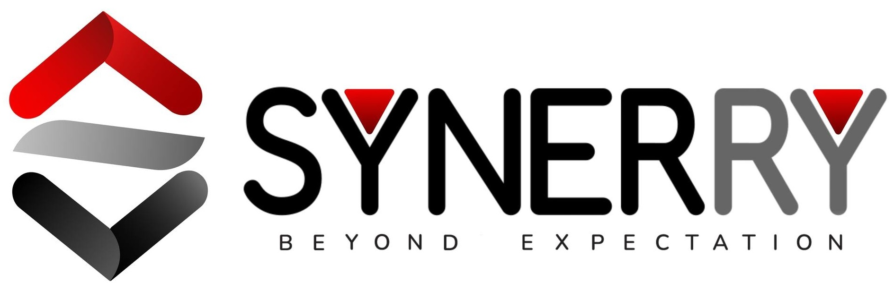

# Professional Experience

## Full-Stack Web Developer
- *Synerry Corporation Co., Ltd.* | May 2024 - August 2024 [May24-Aug24]
- 
- Tags: DEV
- Badges:
  - Bangkok [purple]
  - Intern [gray]
- List Items:
  - Developed full-stack web applications using modern frameworks and best practices
  - Collaborated with cross-functional teams using Agile/Scrum methodologies and participated in code reviews
  - Successfully managed project deadlines, contributed to sprint planning, and tracked KPIs for performance evaluation
  - Enhanced professional development through acquiring both technical skills and effective team collaboration abilities
  - Implemented solutions for real client projects using Laravel, CodeIgniter, and TypeScript frameworks

## IT Support
- *Chanthaburi Technical College* | June 2021 - July 2021 [Jun21-Jul21]
- 
- Tags: Other
- Badges:
  - Chanthaburi [yellow]
  - Intern [gray]
- List Items:
  - Administered network infrastructure and provided comprehensive technical support
  - Performed regular system maintenance and troubleshooting for optimal performance
  - Assisted faculty and students with hardware and software issues

## Maintenance Technician
- *SNC Former PCL* | February 2021 - March 2021 [Feb21-Mar21]
- 
- Tags: Other
- Badges:
  - Rayong [blue]
  - Intern [gray]
- List Items:
  - Assisted production engineers with equipment maintenance and optimization
  - Monitored production line efficiency and implemented improvements
  - Performed preventative maintenance on manufacturing equipment
  - Collaborated with team members to ensure production targets were met

## Computer Technician
- *Advice IT Chanthaburi* | September 2018 - April 2019 [Sep18-Apr19]
- 
- Tags: Other
- Badges:
  - Chanthaburi [yellow]
  - Intern [gray]
- List Items:
  - Diagnosed and repaired hardware and software issues for customers
  - Provided technical consultations and product recommendations
  - Maintained inventory and assisted with sales of computer equipment
  - Delivered exceptional customer service while addressing technical concerns