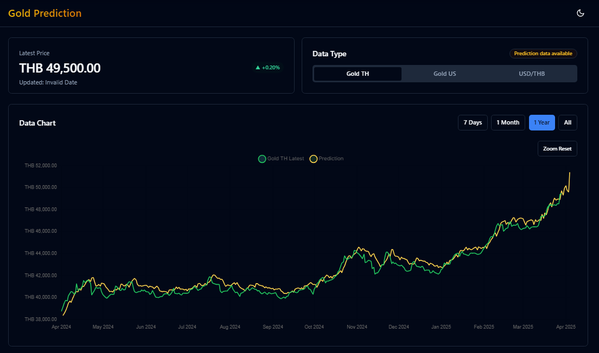

## Gold-Thai Prediction Web

- 
- Tags: Website
- Badges:
  - React [blue]
  - Chart js [red]
  - Radix UI [purple]
  - Django [green]
  - PostgreSQL [blue]
  - Tensorflow [orange]
  - GCP [gray]
- Buttons:
  - Website [https://goldpredictect.web.app/]
  - Github Frontend [https://github.com/ugritchaichana/Gold-Predict-Web-FE/]
  - Github Backend [https://github.com/ugritchaichana/Gold-Predict-Web-BE/]

## Website Portfolio

- 
- Tags: Website
- Badges:
  - React [blue]
  - Chakra UI [teal]
- Buttons:
  - Website [https://ugrit-portfolio-beta.vercel.app/]
  - Github [https://github.com/ugritchaichana/my-portfolio/]

## Website Generate Short URL and QR Code

- 
- Tags: Website
- Badges:
  - React js [blue]
  - Node js [green]
  - Express js [gray]
  - Mongo DB [green]
  - Chakra UI [teal]
- Buttons:
  - Website [https://ugritbooth.netlify.app/]
  - Github Frontend [https://github.com/ugritchaichana/url-shorten-front/]
  - Github Backend [https://github.com/ugritchaichana/url-shorten-back]

## Earthquake Discord Bot

- 
- Tags: Website
- Badges:
  - Node js [green]
  - Express js [gray]
  - Discord js [blue]
  - Render [black]
  - MongoDB [green]
- Buttons:
  - Invite bot [https://discord.com/oauth2/authorize?client_id=1355211555926708354&permissions=8&integration_type=0&scope=bot]
  - Github [https://github.com/ugritchaichana/earthquake-bot-discord/]